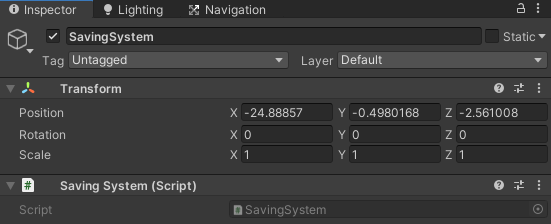
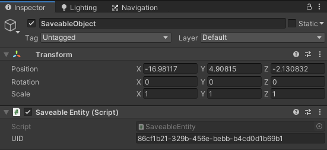
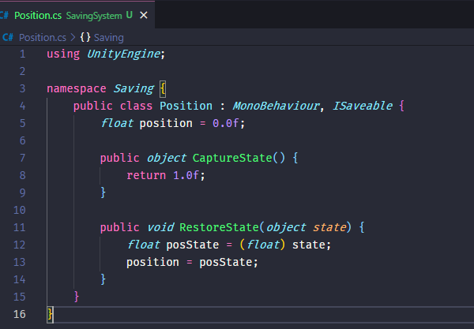

  <h1>
    <SavingSystem>
  </h1>
  <blockquote>
    <REPO_SHORT_DESCRIPTION>
  </blockquote>
  

    
    
    
  

## Tabela de conteúdos

   * [About the Project](#-sobre-o-projeto)
      - [Tecnologias](#-tecnologias)
      - [Como executar](#-como-executar)
   * [Como contribuir](#-como-contribuir)
   * [Licença](#-licença)

## 💻 Sobre o projeto

- This is an open-source saving system to Unity made in C#.

### 🛠 Technologies

The following tools were used in the construction of the project:
- [C#](https://docs.microsoft.com/pt-br/dotnet/csharp/)
- [Unity](https://unity.com)

### 🚀 How to Use

#### 1. Create the "SavingSystem" object
  
Create a GameObject on your scene and add the "SavingSystem" component to it.

  

#### 2. Add the "SaveableEntity" component
  
Add the "SaveableEntity" component to the for the GameObjects you want to save the data and dont modify the ID property.

  

#### 3. Implement the "ISaveable" interface
   
Add the "ISaveable" interface to the classes you want to store data and then implement the interface. On the "CaptureState()" method you need to return the data you want to save and on the "RestoreState()" you want to deal with this data.

   

#### 4. Save and Load
  
Use the "Save(string fileName)" and the "Load(string fileName)" methods from the "SavingSystem" object and be happy :)

## 🤝 How to Contribute

Every kind of contribution is welcome, we admire it!

Is there any problem? Found a bug? Do you have any tips? Open a [issue](https://github.com/serjolas1/SavingSystem/issues) describing.

Want to contribute code? We ask that you first read [this contribution guide](https://github.com/firstcontributions/first-contributions)

Don't forget to leave your ⭐, it is also a way to contribute to the project;)

## 📝 License

This project is under the MIT license. See the archive [LICENSE](LICENSE) for more details.

---

  Criado por [Serjolas1](https://github.com/serjolas1) 💜

